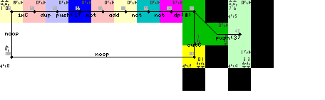

This is the full piet source code:


Example run with [npiet](https://www.bertnase.de/npiet/):
```
$ echo "mySecret" | npiet -q bkkCrypt.png 
mySecret
```

Here is the npiet trace of the top left corner of the program

